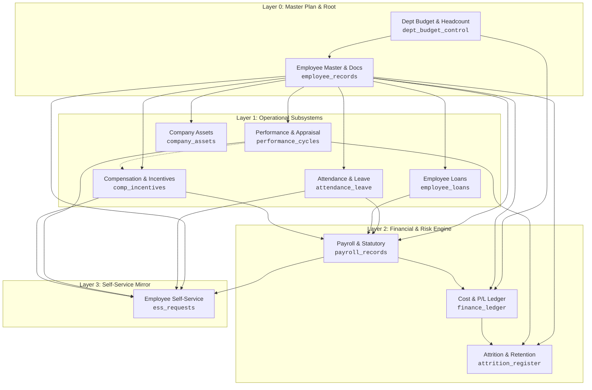

# HR Process Digital Twin — Module Simulator

[](https://reactjs.org/)
[](https://vitejs.dev/)
[](https://expressjs.com/)
[](https://www.postgresql.org/)
[](https://en.wikipedia.org/wiki/Digital_twin)
[-success)](/)

A high-fidelity, full-stack **Human Resource Management Process Digital Twin** and interactive simulation environment. It models, visualizes, and executes state-driven corporate human capital workflows across an interconnected graph network—persisting live operational telemetry and event ledgers into a local PostgreSQL database via flexible JSONB schemas.

---

## Table of Contents
- [1. Process Digital Twin Architecture](#1-process-digital-twin-architecture)
- [2. Interactive Simulation & Core Features](#2-interactive-simulation--core-features)
- [3. Finance Control Tower — Budget, Attrition & Retention Twin](#3-finance-control-tower--budget-attrition--retention-twin)
- [4. Hierarchical Dependency Graph](#4-hierarchical-dependency-graph)
- [5. Compensation, Loans & Statutory Rules Engine](#5-compensation-loans--statutory-rules-engine)
- [6. How the Simulation Engine Works Under the Hood](#6-how-the-simulation-engine-works-under-the-hood)
- [7. Network Protocols & Data Flow](#7-network-protocols--data-flow)
- [8. API Reference](#8-api-reference)
- [9. Installation & Quick-Start Guide](#9-installation--quick-start-guide)
- [10. Project Structure](#10-project-structure)

---

## 1. Process Digital Twin Architecture

Unlike static CRUD HR software that merely stores static tables, this system implements a **Process Digital Twin** as defined in enterprise cyber-physical systems:
1. **Virtual Entity Mirroring:** Mirrors real-world employees, corporate hardware assets, leave balance banks, active loan ledgers, and department structures as stateful digital twins.
2. **Cyber-Physical IoT Emulation:** Integrates physical edge hardware toggles (e.g. Biometric Turnstiles) and network infrastructure states (`NETWORK: ON/DOWN`) to simulate real-world failure modes and offline conditions.
3. **Causal Signal Propagation:** Evaluates how a state change in an upstream node (e.g. Employee Offboarding or Appraisal) automatically cascades downstream across operational, financial, and self-service subsystems.
4. **Bidirectional State Synchronization:** Features glowing real-time sync indicators confirming when React state transitions commit permanently to PostgreSQL storage.



---

## 2. Interactive Simulation & Core Features

### 🏢 Core HR & Employee Lifecycle
* **Dynamic Employee Onboarding:** Automatically initializes master records, creates biometric ledger entries, and credits 3-tier leave balances upon registration.
* **Re-Hiring Alumni Collision Guard:** Prevents naming collisions across active staff and offboarded alumni, protecting historical asset and loan audit trails.
* **Organizational Transfer:** Simulates immediate departmental re-assignment with cross-department verification checks.
* **Promotion & Wage Revision Engine:** Enforces performance appraisal prerequisites, blocks underperforming or un-appraised promotions, and displays a live **Compensation Delta Card** showing daily wage hikes (`+X%`), revised monthly scale, and direct payroll grade adjustments.
* **Reverse-Flow Offboarding Sequence:** Automatically executes a multi-node deprovisioning cascade: locks biometric credentials, returns allocated hardware assets (`Returned (Offboarded)`), clears active loans via Full & Final (F&F) settlement, voids pending leaves, and archives master records.

### ⏱️ Attendance, Leaves & IoT Biometrics
* **Cyber-Physical Biometric Sensor Toggle:** Simulates physical IoT turnstiles. Automatically rejects attendance punches when the sensor is toggled `OFF`.
* **Leave-Aware Biometric Conflict Prevention:** Strictly blocks attendance punches when an employee is on approved full-day leave, while providing shift-aware notices for half-day leaves.
* **3-Tier Quota Ledger:** Tracks corporate leave entitlements (12.0d Annual, 6.0d Casual, 6.0d Sick) with half-day session choices (`First Half` / `Second Half`).
* **Approved Leave Cancellation & Quota Refund:** Allows HR to cancel approved leaves in the Master Explorer, automatically restoring quotas to the employee's ledger and voiding credited travel allowances.
* **Special Statutory Policies:** First-class support for **Maternity Leave** (84d cap with medical certificate validation), **Paternity Leave** (10d cap), **Compensatory Off** (redeemed against weekend deployment shifts), and **On-Duty (OD) Business Travel** (100% paid attendance with automated per-diem allowance and punch waivers).

### 💰 Industrial Multi-Month Payroll Engine
* **Dynamic Calendar Days & Leap-Year Support:** Calculates calendar lengths dynamically (28d/29d Feb, 30d, 31d) with Year Stepper (`2024–2032+`) and a 12-month interactive grid.
* **Dual Execution Modes:**
  * **Standard 30-Day Mode:** Calculates salary based on full calendar days minus approved unpaid leaves.
  * **Strict Attendance Mode:** Scopes calculations exclusively to verified biometric punches and approved leaves dated within the cycle month.
* **Automated Incentive Ingestion:** Parses completed appraisals (`Outstanding` = +₹5,000, `Exceeds Expectations` = +₹2,500) and excellence awards to inject performance bonuses into gross pay.
* **Loan EMI Shortfall & Arrears Tracking:** Caps loan deductions to available net earnings (`gross - pf - tds`). Rolls over any uncollected balance as arrears, updates status to `"Active (EMI in Arrears)"`, freezes tenure months from premature decrement, and ensures loans only mark `"Fully Repaid"` when the principal balance reaches zero.
* **Statutory Deductions:** Computes real-time Indian statutory deductions: **12% Provident Fund (PF)** and **7% Tax Deducted at Source (TDS)**.
* **Special Allowances:** Supports one-time and annual lump-sum allowances (LTA, SCA, Transport, Meal, Internet) credited directly into gross pay.

### 📦 Asset Management & Hardware Lifecycle
* **In-Service Asset Return & Hardware Refresh:** Enables returning assets for active staff (`Hardware Upgrade`, `Normal Return`, `Damaged / Repair Needed`) to free up hardware slots.
* **Direct Explorer Quick Actions:** One-click **"Return"** button right inside the `company_assets` table.
* **Startup Self-Healing Auto-Reconciliation:** Automatically identifies any historical orphan assets held by inactive staff and syncs their status to `"Returned (Offboarded)"` directly to PostgreSQL on app boot.

### 📱 Employee Self-Service (ESS) & Approvals Center
* **7 Self-Service Workflows:** Payslip Download, Leave Balance Check, Attendance Regularization, Reimbursement Claims, Profile Update (KYC/Address/Contact), HR Document Requests (Bonafide/Experience Certificate), and HR/IT Helpdesk Ticketing.
* **Central HR Approvals & Operations Center:** Slide-out Approvals Drawer with pending badges, 1-click approvals/rejections, and automated downstream side-effects.
* **Network Outage Guard:** Displays a prominent red warning banner in the Approvals Drawer and disables all actions when `NETWORK: DOWN` is active, safeguarding simulation integrity.

### 🗄️ Master Database & Live Records Explorer
* **Dynamic Column Union Engine:** Computes a union of all unique keys across all records in the table, preventing heterogeneous fields (e.g. `balance`, `dates`, `loanArrears`, `returnedDate`) from being clipped.
* **Automatic Rate Fallback & Formatting:** Automatically resolves and formats employee daily rates (`₹1,000`, `₹1,500`) in emerald green.
* **Record Inspector:** Inspects raw JSON payloads and relational keys for any row in the system.
* **Search & Quick Filtering:** Instant fuzzy search across records, statuses, and employee names.

---

## 3. Finance Control Tower — Budget, Attrition & Retention Twin

This is the layer that turns the HRMS from a *record keeper* into a *digital twin*: a third persona, the **Accountant / Finance Controller**, owns the money and the headcount ceiling, and every workforce action is priced against that plan before it is allowed to happen.

Switch personas with the **ROLE** button in the header — it cycles `HR ADMIN → ACCOUNTANT → EMPLOYEE`. The Finance Control Tower panel is visible to everyone but is read-only unless the Accountant persona is active (same RBAC pattern the HR actions already use).

### The Three Financial & Risk Modules

| Module | Table | What it holds |
| :--- | :--- | :--- |
| **Dept Budget & Headcount** | `dept_budget_control` | One control row per department: sanctioned headcount ceiling, annual budget envelope, one-time spend booked to date. |
| **Cost & P/L Ledger** | `finance_ledger` | Every rupee that moves — onboarding, retention, succession, attrition loss, budget amendments. |
| **Attrition & Retention** | `attrition_register` | Exits, retention packages, and the vacancy register with its fill history. |

These join the dependency graph as real nodes, so `emp_docs` depends on `budget`, and `finance_ledger` / `attrition` sit downstream of employees, payroll and performance.

### 1. Onboarding is Budget-Gated

HR cannot create an employee until the accountant's model clears the hire. `evaluateHire()` checks two independent ceilings and **blocks the hire** with a written reason if either fails:

* **Sanctioned strength** — the department is capped at a fixed headcount that only the Accountant can raise.
* **Money envelope** — the hire's full year-one draw (one-time onboarding + annual run-rate) must fit inside the uncommitted balance.

The itemised onboarding cost is modelled per grade and posted to the ledger:

| Cost Head | Associate | Director |
| :--- | ---: | ---: |
| Recruitment / agency fee | ₹45,000 | ₹4,20,000 |
| Induction & skills training | ₹35,000 | ₹1,20,000 |
| Relocation & travel | ₹12,000 | ₹85,000 |
| IT asset provisioning | ₹55,000 | ₹1,10,000 |
| Onboarding admin & payroll setup | ₹8,000 | ₹25,000 |
| Background verification | ₹4,000 | ₹15,000 |
| **One-time total** | **₹1,59,000** | **₹7,75,000** |

### 2. Every Employee Gets a Profit & Loss Verdict

`employeeROIModel()` answers the questions a CFO / Accountant actually asks:

* **Annual Cost**: Daily rate $\times 30 \times 12$, plus an **18% employer statutory load** (PF, ESI, gratuity accrual, insurance), plus workspace and tooling overhead.
* **Annual Value**: Modelled output of a fully ramped person at that grade.
* **Steady-State Margin**: $\text{Value} - \text{Cost} \rightarrow$ verdict of `Profitable` / `Break-even` / `Loss-making`.
* **Break-Even Months**: How long that margin takes to repay the one-time onboarding spend *and* the ramp-up productivity drag (new joiners run at 45–60% output for their first 2–5 months depending on grade).
* **Net to Date**: What the person has actually contributed so far. A negative number means the company has not yet earned back what it spent to hire them — which is precisely why an early exit is expensive.

### 3. Attrition Risk is Predicted, Explained and Priced

`flightRiskModel()` scores every active employee on a scale of **0–100** from live behavioral and structural HRMS signals. The model starts at a baseline of **10 points** (inherent background turnover), evaluates live metrics, and **returns its own auditable reasoning** so the dashboard explains exactly *why* an employee is at risk:

| Category | Signal / Condition | Point Impact | HR & Economic Reasoning |
| :--- | :--- | :---: | :--- |
| **Status** | Already on Notice Period | **= 100** | Resignation already formally tendered. |
| **Tenure** | Early tenure (`< 6 months`) | **+12** | Onboarding failure window; cultural misfit during probation. |
| | Under 1 year (`6 – 12 months`) | **+8** | Still settling into team and domain. |
| | Peak-risk band (`12 – 30 months`) | **+22** | **"The 2-Year Itch"**: Peak marketability; highest poaching window. |
| | Mid tenure (`30 – 48 months`) | **+12** | Seeking the next step in career development. |
| | Long tenure (`> 48 months`) | **+4** | Culturally and geographically anchored; low voluntary exit rate. |
| **Progression** | No promotion for `≥ 30 months` | **+20** | **Career Stagnation**: Employee feels stalled at grade ceiling. |
| | No promotion for `18 – 30 months` | **+11** | Mild progression slowdown. |
| **Compensation** | Paid below grade band (`Compa-Ratio < 0.95`) | **+18** | **Underpaid vs Market**: Susceptible to 20–30% pay jumps. |
| | Slightly below median (`0.95 – 1.00`) | **+9** | Slightly trailing peer group. |
| | Paid above band (`Compa-Ratio ≥ 1.10`) | **−10** | **Golden Handcuffs**: Competitors struggle to match compensation. |
| **Appraisal** | High Performer (`Outstanding` / `Exceeds`) with `≥ 18mo` stagnation | **+16** | **Top talent neglected**: High external value, low internal mobility. |
| | High Performer with recent progression | **+5** | High market appeal, but actively engaged. |
| | Low Rating (`Needs Improvement` / `Unsatisfactory`) | **+12** | Disengagement risk or performance strain. |
| | **No appraisal on file** | **+8** | **Unrecognised / Unmanaged**: Lack of feedback breeds isolation. |
| | Excellence Awards received | **−8** | Public recognition fosters organisational pride and loyalty. |
| **Behavioral** | High recent leave (`≥ 6 days in last 90 days`) | **+10** | Warning indicator of interview travel, fatigue, or burnout. |
| | Open / Escalated ESS tickets (`≥ 2`) | **+10** | Unresolved operational, IT, or payroll grievances. |
| | Open / Escalated ESS tickets (`1`) | **+6** | Pending grievance. |
| | **Active Company Loan** | **−12** | **Financial Anchor**: Active company debt discourages voluntary exits. |
| **Department** | Department has **No Active Manager** | **+9** | **Leadership Vacuum**: Teams without a lead suffer elevated turnover. |
| | Department Vacancy Rate `≥ 30%` | **+8** | **Workload Strain**: Remaining staff absorb overtime and empty seats. |
| | Macro Market Shock (What-If slider) | **+0 to +40** | Competitor hiring wave or aggressive poaching shock. |

> **Score Bounds & Bands**: Total score is capped between **2** and **97** (or **100** if formally serving notice).

#### Risk Classification Bands
* 🔴 **Critical (75–100 pts):** Imminent exit; requires urgent retention review.
* 🟠 **High (55–74 pts):** High flight risk; evaluate counter-offer vs. replacement.
* 🟡 **Moderate (30–54 pts):** Watchlist; monitor workload, recognition, and performance appraisal.
* 🟢 **Low (0–29 pts):** Stable, well-anchored contributor.

`attritionLossModel()` then prices the exit across six heads — backfill recruitment, vacancy output loss, knowledge and handover loss, team coverage strain, a leadership-gap premium for managers, and exit admin. Multiplying by the risk score gives a **probability-weighted risk provision** rolled up across the company.

### 4. Retention vs. Replacement — The Core Decision

The **Retention Desk** evaluates counter-offer levers against the modelled cost of the exit they prevent:

| Lever | Mechanism | Risk Relief | Requirement |
| :--- | :--- | :---: | :--- |
| **Pay Correction** | +8% base salary adjustment | **−14 pts** | Fast fix for underpaid staff below grade band median. |
| **Retention Hike** | +15% off-cycle raise | **−26 pts** | Strong financial counter-offer against external poaching. |
| **Promotion** | Elevate to next grade salary band | **−38 pts** | Eliminates career stagnation. *(Requires approved appraisal)*. |
| **Retention Bonus** | 2 months salary one-time cash bonus | **−18 pts** | Immediate liquidity without permanent payroll run-rate inflation. |

#### Financial Decision Economics:
* **Year-1 Cost**:
  $$\text{Year-1 Cost} = (\text{New Annual} - \text{Current Annual}) \times (1 + \text{STATUTORY\_LOAD}) + \text{One-Time Bonus}$$
  *(where $\text{STATUTORY\_LOAD} = 18\%$ for employer PF, ESI, gratuity accrual, and insurance).*
* **Expected Saving**:
  $$\text{Expected Saving} = \text{Modelled Exit Loss} \times \frac{\text{Risk}_{\text{current}} - \text{Risk}_{\text{residual}}}{100}$$
* **Net Benefit & Verdict**:
  $$\text{Net Benefit} = \text{Expected Saving} - \text{Year-1 Cost}$$
  * If $\text{Net Benefit} > 0$: **`✓ RETAIN`** — Retention package pays for itself.
  * If $\text{Net Benefit} \le 0$: **`✕ RELEASE`** — Package costs more than the exit it prevents (*Let go & backfill*).

> **Successor Dampening**: If an internal successor exists (e.g. cross-department transfer or junior peer), vacancy downtime collapses from 60 days to **12 days** and external agency recruitment fees are cut by **65%**, naturally advising `RELEASE` on non-critical roles. HR managers can override and approve retention packages at any time.

### 5. Vacancies, Succession and the Promotion Cascade

When someone is offboarded the twin automatically:
1. Books the attrition loss to the ledger and the department budget.
2. Opens a **vacancy** with a daily carrying cost (forgone output) that accrues for every day the seat stays empty.
3. Searches for a replacement in the order a real HR team would — same grade in the same team (*Lateral Cover*), then a promotable junior (*Internal Promotion*), then a same-grade person in another department (*Cross-Dept Transfer*).
4. **If a manager leaves, succession fires automatically**: the closest-grade candidate with a clean appraisal is named Acting Manager and the leadership gap closes in days instead of weeks. If no successor exists, the twin warns that the department is now leaderless — which feeds straight back into everyone else's flight risk.

Filling a vacancy by promotion **cascades a new vacancy** one grade down, exactly as it would in reality. Filling it externally re-runs the full budget gate.

### 6. What-If Scenario Simulator

The **What-If** tab re-runs the entire cost/risk/vacancy model under changed assumptions **without touching the live tables**:
* **Blanket salary hike (0–25%)** — raises run-rate cost, lowers flight risk across the board.
* **Market attrition shock (0–40 pts)** — a competitor hiring spree pushing everyone's risk up.
* **Hiring freeze** — leaves every vacant seat unfilled and quantifies the forgone output.
* **Leadership retention focus** — extra risk relief on manager-grade roles.

It reports projected payroll run-rate, modelled output, expected attrition loss and risk-adjusted net P&L against the baseline, and closes with a recommendation — typically that targeting the handful of genuinely high-risk individuals beats raising everyone, because the same money buys far more retention when aimed at the people who would actually leave.

### 7. Live Workforce Visibility

The KPI strip and the department cards on the org chart show, live: **headcount vs. sanctioned**, **on leave today**, **vacant seats**, **serving notice**, **flight-risk count**, **budget utilisation**, **net annual P&L**, **attrition rate**, and the **risk provision**.

---

## 4. Hierarchical Dependency Graph

The simulation organizes HR modules into strict architectural layers calculated dynamically via:
$$\text{Layer} = \max(\text{Parent Layers}) + 1$$

| Layer | Module ID | Module Name | Database Table | Upstream Dependencies |
|:---:|:---|:---|:---|:---|
| **0** | `budget` | Dept Budget & Headcount | `dept_budget_control` | *None (Master Financial Plan)* |
| **0** | `emp_docs` | Employee & Docs | `employee_records` | `budget` |
| **1** | `attendance_leave` | Attendance & Leave | `attendance_leave` | `emp_docs` |
| **1** | `performance` | Performance & Appraisal | `performance_cycles` | `emp_docs` |
| **1** | `assets` | Asset Management | `company_assets` | `emp_docs` |
| **1** | `loans` | Loan Management | `employee_loans` | `emp_docs` |
| **1** | `comp_incentives` | Compensation & Incentives | `comp_incentives` | `emp_docs`, `performance` |
| **2** | `payroll` | Payroll & Statutory | `payroll_records` | `emp_docs`, `attendance_leave`, `loans`, `comp_incentives` |
| **2** | `finance_ledger` | Cost & P/L Ledger | `finance_ledger` | `budget`, `emp_docs`, `payroll` |
| **2** | `attrition` | Attrition & Retention | `attrition_register` | `emp_docs`, `performance`, `finance_ledger` |
| **3** | `ess` | Self-Service (ESS) | `ess_requests` | `emp_docs`, `attendance_leave`, `payroll`, `performance`, `comp_incentives` |
| **1+**| `m_*` | *Custom Module(s)* | `*_records` | *Dynamic (e.g. emp_docs)* |

---

## 5. Compensation, Loans & Statutory Rules Engine

### Designation Daily Wage Rates
Used to dynamically calculate monthly base salary ($\text{Daily Rate} \times \text{Billable Days}$):

| Designation | Daily Wage Rate | Standard 30-Day Monthly Base |
|---|:---:|:---:|
| **Associate** | ₹1,000 / day | ₹30,000 |
| **Specialist** | ₹1,500 / day | ₹45,000 |
| **Senior Specialist** | ₹2,000 / day | ₹60,000 |
| **Lead** | ₹2,500 / day | ₹75,000 |
| **Manager** | ₹3,500 / day | ₹1,05,000 |
| **Senior Manager** | ₹5,000 / day | ₹1,50,000 |
| **Director** | ₹8,000 / day | ₹2,40,000 |

### Corporate Excellence Awards
Award bonuses disbursed during the payroll run:
* **Star Performer:** ₹5,000
* **Innovation Champion:** ₹3,500
* **Team Player:** ₹2,000
* **Rising Star / Spot Excellence:** ₹1,500

### Loan Management — Equated Monthly Installment (EMI) Formula
Amortized monthly loan deductions are calculated using the standard annuity formula:
$$\text{EMI} = \frac{P \times r \times (1 + r)^n}{(1 + r)^n - 1}$$
Where:
* $P$ = Principal loan amount
* $r$ = Monthly interest rate ($\text{Annual Rate} / 12$)
* $n$ = Repayment tenure in months

### Loan Arrears & Net Pay Protection Rule
To protect employees from negative or zero take-home pay during cycles with unpaid leaves or high deductions:
1. **Net Available Earnings**:
   $$\text{Net Available} = \max(0, \text{Gross} - \text{PF (12\%)} - \text{TDS (7\%)})$$
2. **Actual Deduction**:
   $$\text{Actual EMI Deducted} = \min(\text{Nominal EMI}, \text{Net Available})$$
3. **Arrears Roll-Over**:
   $$\text{EMI Shortfall (Arrears)} = \text{Nominal EMI} - \text{Actual EMI Deducted}$$
4. **Final Take-Home Pay**:
   $$\text{Take-Home Net Pay} = \text{Net Available} - \text{Actual EMI Deducted}$$

If a shortfall occurs, the loan status updates to `"Active (EMI in Arrears)"`, tenure months remain frozen from premature decrements, and uncollected balances roll over cleanly.

---

## 6. How the Simulation Engine Works Under the Hood

```
[UI Trigger / Action] 
       │
       ▼
[execute(steps)] ───► [Promise Loop: sleep(ms)] ───► [Highlights Active SVG Nodes & Edges]
       │                                                         │
       ├──► [Appends Entry to Live Operation Log]                ▼
       ├──► [Mutates In-Memory React State db]           [CSS Glow Transitions]
       └──► [Dispatches Async POST /api/records] ───────► [PostgreSQL JSONB Commit]
```

1. **Deliberate Temporal Progression:** Steps are orchestrated through JavaScript Promises:
   ```javascript
   const sleep = (ms) => new Promise((r) => setTimeout(r, ms));
   ```
   Sequential delays create the deliberate, visible sensation of transactions traversing network cables and enterprise service buses.
2. **State-Driven SVG Animation:** Active steps add module keys to `hlNodes` and `hlEdges`. React re-renders SVG elements with active CSS transition classes (`.active-node`), producing real-time glowing highlights.
3. **Database Sync Indicator:** Displays real-time database state (`syncing` $\rightarrow$ `synced` $\rightarrow$ `idle`), giving instant feedback on PostgreSQL commits.

---

## 7. Network Protocols & Data Flow

```
┌─────────────────────────────────────────────────────────────────┐
│                    Browser (Client Session)                     │
└──────────────┬───────────────────────────▲──────────────────────┘
               │ HTTP / REST API           │ WebSocket / HMR
               │ (Port 3000)               │ (Port 5173)
┌──────────────▼─────────────┐ ┌───────────┴──────────────────────┐
│ Backend (Express.js Server)│ │ Vite Development Server (Frontend)│
└──────────────┬─────────────┘ └──────────────────────────────────┘
               │ PostgreSQL Wire Protocol (TCP)
               │ (Port 5432)
┌──────────────▼──────────────────────────────────────────────────┐
│                  Database (PostgreSQL hrms_db)                  │
│                  - hrms_modules (Table schema & layers)         │
│                  - hrms_records (JSONB data rows)               │
└─────────────────────────────────────────────────────────────────┘
```

1. **HTTP/REST (Browser $\leftrightarrow$ Backend):** RESTful endpoints for querying modules, inserting transactional records, and updating active states.
2. **PostgreSQL Native Wire Protocol (Backend $\leftrightarrow$ Database):** Communicates via the `pg` client using PostgreSQL's binary TCP wire protocol over port `5432`.
3. **WebSocket HMR (Dev Server):** Vite pushes Hot Module Replacement updates directly into the browser session without full page reloads.

---

## 8. API Reference

| Method | Endpoint | Description | Payload / Parameters |
|:---:|:---|:---|:---|
| `GET` | `/api/modules` | Fetch all registered HR modules and dynamic schemas | None |
| `POST` | `/api/modules` | Register or update a module | `{ id, name, layer, table_name, active, is_custom, schema }` |
| `PATCH`| `/api/modules/:id` | Activate or deactivate a custom module | `{ active: boolean }` |
| `GET` | `/api/records` | Fetch records (optionally filtered by `module_id`) | Query param: `?module_id=<id>` |
| `POST` | `/api/records` | Upsert a record with JSONB shallow merge | `{ id: string, module_id: string, data: object }` |
| `DELETE`| `/api/reset` | Deactivate custom modules & restore default system modules | Query param: `?clear_records=true` (optional, purges simulation records) |

---

## 9. Installation & Quick-Start Guide

### Prerequisites
* **Node.js:** v18.0 or higher
* **PostgreSQL:** v13.0 or higher
* **npm:** v8.0 or higher

---

### Step 1: Database Setup
Open pgAdmin or `psql` and create the PostgreSQL database:
```sql
CREATE DATABASE hrms_db;
```
Connect to `hrms_db` and execute the schema initialization:
```sql
-- Track module structure and custom schemas
CREATE TABLE hrms_modules (
  id TEXT PRIMARY KEY,
  name TEXT NOT NULL,
  layer INTEGER NOT NULL,
  table_name TEXT NOT NULL,
  active BOOLEAN DEFAULT TRUE,
  is_custom BOOLEAN DEFAULT TRUE,
  schema JSONB
);

-- Store polymorphic entity records flexibly via JSONB
CREATE TABLE hrms_records (
  id TEXT NOT NULL,
  module_id TEXT NOT NULL, 
  data JSONB NOT NULL,     
  created_at TIMESTAMP WITH TIME ZONE DEFAULT CURRENT_TIMESTAMP NOT NULL,
  PRIMARY KEY (id, module_id)
);
```

---

### Step 2: Start the Express Backend Server
1. Open a terminal and navigate to the `server/` directory:
   ```bash
   cd server
   npm install
   ```
2. Configure your database credentials in `server/.env`:
   ```env
   DB_USER=postgres
   DB_PASSWORD=your_password
   DB_HOST=localhost
   DB_PORT=5432
   DB_NAME=hrms_db
   PORT=3000
   ```
3. Start the server:
   ```bash
   node server.js
   ```
   *Expected output:* `Successfully connected to database: hrms_db` and `Server listening on port 3000`.

---

### Step 3: Seed Default System Modules
In a new terminal window inside the `server/` directory:
```bash
node seed_direct.js
```
> **Tip:** If updating an existing database from an earlier version, run `node migrate.js` to ensure the `schema` JSONB column and updated compound primary keys are applied.

---

### Step 4: Start the React Frontend
> **Important:** Always execute this from the project root directory where `package.json` resides (not inside `server/` or a parent folder).

1. In a separate terminal window at the project root:
   ```bash
   npm install
   npm run dev
   ```
2. Open your browser and navigate to:
   👉 **`http://localhost:5173`**

---

## 10. Project Structure

```
simulation-hrms/
├── dist/                    # Compiled production bundle
├── server/                  # Express.js REST API server
│   ├── .env                 # Database credentials & port configuration
│   ├── migrate.js           # Database schema migration script
│   ├── package.json         # Backend dependencies (express, pg, cors, dotenv)
│   ├── seed_direct.js       # Default module seeder for PostgreSQL
│   └── server.js            # Express routes and PostgreSQL connection pool
├── src/                     # React application source
│   └── main.jsx             # React entry point mounting module_simulation.jsx
├── index.html               # Main application HTML shell
├── module_simulation.jsx    # Complete Digital Twin & Simulation Engine component
├── package.json             # Frontend dependencies (react, lucide-react, vite)
├── synopsis.tex             # Comprehensive academic project report (LaTeX)
├── vite.config.js           # Vite configuration
├── Work_Log.md              # Chronological project development log
└── README.md                # Project documentation
```
