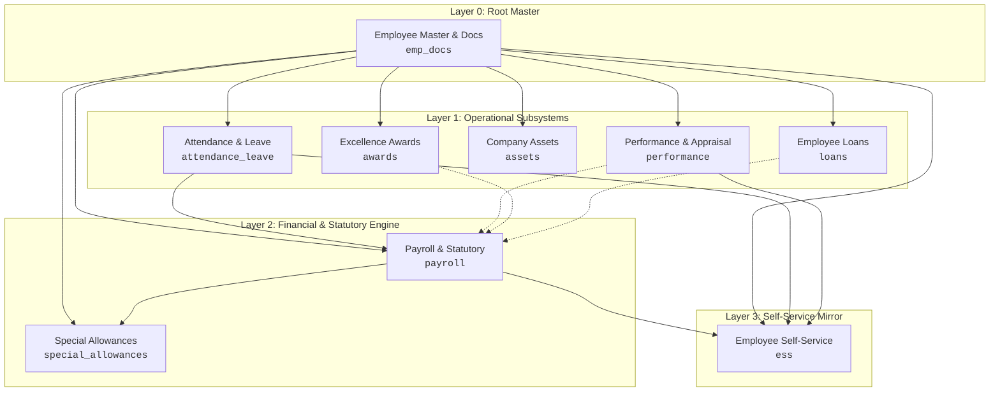

# HR Process Digital Twin — Module Simulator

[](https://reactjs.org/)
[](https://vitejs.dev/)
[](https://expressjs.com/)
[](https://www.postgresql.org/)
[](https://en.wikipedia.org/wiki/Digital_twin)
[-success)](/)

A high-fidelity, full-stack **Human Resource Management Process Digital Twin** and interactive simulation environment. It models, visualizes, and executes state-driven corporate human capital workflows across an interconnected graph network—persisting live operational telemetry and event ledgers into a local PostgreSQL database via flexible JSONB schemas.

---

## Table of Contents
- [1. Process Digital Twin Architecture](#1-process-digital-twin-architecture)
- [2. Interactive Simulation & Core Features](#2-interactive-simulation--core-features)
- [3. Hierarchical Dependency Graph](#3-hierarchical-dependency-graph)
- [4. Compensation & Rules Engine](#4-compensation--rules-engine)
- [5. How the Simulation Engine Works Under the Hood](#5-how-the-simulation-engine-works-under-the-hood)
- [6. Network Protocols & Data Flow](#6-network-protocols--data-flow)
- [7. API Reference](#7-api-reference)
- [8. Installation & Quick-Start Guide](#8-installation--quick-start-guide)
- [9. Project Structure](#9-project-structure)

---

## 1. Process Digital Twin Architecture

Unlike static CRUD HR software that merely stores static tables, this system implements a **Process Digital Twin** as defined in enterprise cyber-physical systems:
1. **Virtual Entity Mirroring:** Mirrors real-world employees, corporate hardware assets, leave balance banks, active loan ledgers, and department structures as stateful digital twins.
2. **Cyber-Physical IoT Emulation:** Integrates physical edge hardware toggles (e.g. Biometric Turnstiles) and network infrastructure states (`NETWORK: ON/DOWN`) to simulate real-world failure modes and offline conditions.
3. **Causal Signal Propagation:** Evaluates how a state change in an upstream node (e.g. Employee Offboarding or Appraisal) automatically cascades downstream across operational, financial, and self-service subsystems.
4. **Bidirectional State Synchronization:** Features glowing real-time sync indicators confirming when React state transitions commit permanently to PostgreSQL storage.



---

## 2. Interactive Simulation & Core Features

### 🏢 Core HR & Employee Lifecycle
* **Dynamic Employee Onboarding:** Automatically initializes master records, creates biometric ledger entries, and credits 3-tier leave balances upon registration.
* **Re-Hiring Alumni Collision Guard:** Prevents naming collisions across active staff and offboarded alumni, protecting historical asset and loan audit trails.
* **Organizational Transfer:** Simulates immediate departmental re-assignment with cross-department verification checks.
* **Promotion & Wage Revision Engine (Feature S.4):** Enforces performance appraisal prerequisites, blocks underperforming or un-appraised promotions, and displays a live **Compensation Delta Card** showing daily wage hikes (`+X%`), revised monthly scale, and direct payroll grade adjustments.
* **Reverse-Flow Offboarding Sequence:** Automatically executes a multi-node deprovisioning cascade: locks biometric credentials, returns allocated hardware assets (`Returned (Offboarded)`), clears active loans via Full & Final (F&F) settlement, voids pending leaves, and archives master records.

### ⏱️ Attendance, Leaves & IoT Biometrics
* **Cyber-Physical Biometric Sensor Toggle:** Simulates physical IoT turnstiles. Automatically rejects attendance punches when the sensor is toggled `OFF`.
* **Leave-Aware Biometric Conflict Prevention:** Strictly blocks attendance punches when an employee is on approved full-day leave, while providing shift-aware notices for half-day leaves.
* **3-Tier Quota Ledger:** Tracks corporate leave entitlements (12.0d Annual, 6.0d Casual, 6.0d Sick) with half-day session choices (`First Half` / `Second Half`).
* **Approved Leave Cancellation & Quota Refund (Item 2.2):** Allows HR to cancel approved leaves in the Master Explorer, automatically restoring quotas to the employee's ledger and voiding credited travel allowances.
* **Special Statutory Policies:** First-class support for **Maternity Leave** (84d cap with medical certificate validation), **Paternity Leave** (10d cap), **Compensatory Off** (redeemed against weekend deployment shifts), and **On-Duty (OD) Business Travel** (100% paid attendance with automated per-diem allowance and punch waivers).

### 💰 Industrial Multi-Month Payroll Engine
* **Dynamic Calendar Days & Leap-Year Support:** Calculates calendar lengths dynamically (28d/29d Feb, 30d, 31d) with Year Stepper (`2024–2032+`) and a 12-month interactive grid.
* **Dual Execution Modes:**
  * **Standard 30-Day Mode:** Calculates salary based on full calendar days minus approved unpaid leaves.
  * **Strict Attendance Mode:** Scopes calculations exclusively to verified biometric punches and approved leaves dated within the cycle month.
* **Automated Incentive Ingestion:** Parses completed appraisals (`Outstanding` = +₹5,000, `Exceeds Expectations` = +₹2,500) and excellence awards to inject performance bonuses into gross pay.
* **Loan EMI Shortfall & Arrears Tracking (Item 2.4 & Bug 2 Fix):** Caps loan deductions to available net earnings (`gross - pf - tds`). Rolls over any uncollected balance as arrears, updates status to `"Active (EMI in Arrears)"`, freezes tenure months from premature decrement, and ensures loans only mark `"Fully Repaid"` when the principal balance reaches zero.
* **Statutory Deductions:** Computes real-time Indian statutory deductions: **12% Provident Fund (PF)** and **7% Tax Deducted at Source (TDS)**.
* **Special Allowances:** Supports one-time and annual lump-sum allowances (LTA, SCA, Transport, Meal, Internet) credited directly into gross pay.

### 📦 Asset Management & Hardware Lifecycle
* **In-Service Asset Return & Hardware Refresh (Item 2.1):** Enables returning assets for active staff (`Hardware Upgrade`, `Normal Return`, `Damaged / Repair Needed`) to free up hardware slots.
* **Direct Explorer Quick Actions:** One-click **"Return"** button right inside the `company_assets` table.
* **Startup Self-Healing Auto-Reconciliation:** Automatically identifies any historical orphan assets held by inactive staff and syncs their status to `"Returned (Offboarded)"` directly to PostgreSQL on app boot.

### 📱 Employee Self-Service (ESS) & Approvals Center
* **7 Self-Service Workflows:** Payslip Download, Leave Balance Check, Attendance Regularization, Reimbursement Claims, Profile Update (KYC/Address/Contact), HR Document Requests (Bonafide/Experience Certificate), and HR/IT Helpdesk Ticketing.
* **Central HR Approvals & Operations Center:** Slide-out Approvals Drawer with pending badges, 1-click approvals/rejections, and automated downstream side-effects.
* **Network Outage Guard (Item 1.3):** Displays a prominent red warning banner in the Approvals Drawer and disables all actions when `NETWORK: DOWN` is active, safeguarding simulation integrity.

### 🗄️ Master Database & Live Records Explorer
* **Dynamic Column Union Engine (Bug 1 Fix):** Computes a union of all unique keys across all records in the table, preventing heterogeneous fields (e.g. `balance`, `dates`, `loanArrears`, `returnedDate`) from being clipped.
* **Automatic Rate Fallback & Formatting:** Automatically resolves and formats employee daily rates (`₹1,000`, `₹1,500`) in emerald green.
* **Record Inspector:** Inspects raw JSON payloads and relational keys for any row in the system.
* **Search & Quick Filtering:** Instant fuzzy search across records, statuses, and employee names.

---

## 3. Hierarchical Dependency Graph

The simulation organizes HR modules into strict architectural layers calculated dynamically via:
$$\text{Layer} = \max(\text{Parent Layers}) + 1$$

| Layer | Module ID | Module Name | Database Table | Upstream Dependencies |
|:---:|:---|:---|:---|:---|
| **0** | `emp_docs` | Employee & Docs | `employee_records` | *None (Root Master)* |
| **1** | `attendance_leave` | Attendance & Leave | `attendance_leave` | `emp_docs` |
| **1** | `performance` | Performance & Appraisal | `performance_cycles` | `emp_docs` |
| **1** | `assets` | Asset Management | `company_assets` | `emp_docs` |
| **1** | `loans` | Loan Management | `employee_loans` | `emp_docs` |
| **1** | `awards` | Excellence Awards | `excellence_awards` | `emp_docs` |
| **2** | `payroll` | Payroll & Statutory | `payroll_records` | `emp_docs`, `attendance_leave` |
| **2** | `special_allowances` | Special Allowances | `special_allowances` | `emp_docs`, `payroll` |
| **3** | `ess` | Self-Service (ESS) | `ess_requests` | `emp_docs`, `attendance_leave`, `payroll`, `performance` |
| **1+**| `m_*` | *Custom Module(s)* | `*_records` | *Dynamic (e.g. emp_docs)* |

---

## 4. Compensation & Rules Engine

### Designation Daily Wage Rates
Used to dynamically calculate monthly base salary ($\text{Daily Rate} \times \text{Billable Days}$):

| Designation | Daily Wage Rate | Standard 30-Day Monthly Base |
|---|:---:|:---:|
| **Associate** | ₹1,000 / day | ₹30,000 |
| **Specialist** | ₹1,500 / day | ₹45,000 |
| **Senior Specialist** | ₹2,000 / day | ₹60,000 |
| **Lead** | ₹2,500 / day | ₹75,000 |
| **Manager** | ₹3,500 / day | ₹1,05,000 |
| **Senior Manager** | ₹5,000 / day | ₹1,50,000 |
| **Director** | ₹8,000 / day | ₹2,40,000 |

### Corporate Excellence Awards
Award bonuses disbursed during the payroll run:
* **Star Performer:** ₹5,000
* **Innovation Champion:** ₹3,500
* **Team Player:** ₹2,000
* **Rising Star / Spot Excellence:** ₹1,500

---

## 5. How the Simulation Engine Works Under the Hood

```
[UI Trigger / Action] 
       │
       ▼
[execute(steps)] ───► [Promise Loop: sleep(ms)] ───► [Highlights Active SVG Nodes & Edges]
       │                                                         │
       ├──► [Appends Entry to Live Operation Log]                ▼
       ├──► [Mutates In-Memory React State db]           [CSS Glow Transitions]
       └──► [Dispatches Async POST /api/records] ───────► [PostgreSQL JSONB Commit]
```

1. **Deliberate Temporal Progression:** Steps are orchestrated through JavaScript Promises:
   ```javascript
   const sleep = (ms) => new Promise((r) => setTimeout(r, ms));
   ```
   Sequential delays create the deliberate, visible sensation of transactions traversing network cables and enterprise service buses.
2. **State-Driven SVG Animation:** Active steps add module keys to `hlNodes` and `hlEdges`. React re-renders SVG elements with active CSS transition classes (`.active-node`), producing real-time glowing highlights.
3. **Database Sync Indicator:** Displays real-time database state (`syncing` $\rightarrow$ `synced` $\rightarrow$ `idle`), giving instant feedback on PostgreSQL commits.

---

## 6. Network Protocols & Data Flow

```
┌────────────────────────────────────────────────────────┐
│               Browser (React + Vite)                   │
└──────────────┬───────────────────────────▲─────────────┘
               │ HTTP / JSON               │ WebSocket / HMR
               │ (Port 3000)               │ (Port 5173/5174)
┌──────────────▼───────────────────────────┴─────────────┐
│              Backend (Express.js Server)               │
└──────────────┬─────────────────────────────────────────┘
               │ PostgreSQL Wire Protocol (TCP)
               │ (Port 5432)
┌──────────────▼─────────────────────────────────────────┐
│              Database (PostgreSQL hrms_db)             │
│              - hrms_modules (Table schema & layers)    │
│              - hrms_records (JSONB data rows)          │
└────────────────────────────────────────────────────────┘
```

1. **HTTP/REST (Browser $\leftrightarrow$ Backend):** RESTful endpoints for querying modules, inserting transactional records, and updating active states.
2. **PostgreSQL Native Wire Protocol (Backend $\leftrightarrow$ Database):** Communicates via the `pg` client using PostgreSQL's binary TCP wire protocol over port `5432`.
3. **WebSocket HMR (Dev Server):** Vite pushes Hot Module Replacement updates directly into the browser session without full page reloads.

---

## 7. API Reference

| Method | Endpoint | Description | Payload / Parameters |
|:---:|:---|:---|:---|
| `GET` | `/api/modules` | Fetch all registered HR modules and dynamic schemas | None |
| `POST` | `/api/modules` | Register a new custom module | `{ id, name, layer, table_name, active, is_custom, schema }` |
| `PATCH`| `/api/modules/:id` | Activate or deactivate a custom module | `{ active: boolean }` |
| `GET` | `/api/records` | Fetch records (optionally filtered by `module_id`) | Query param: `?module_id=<id>` |
| `POST` | `/api/records` | Upsert a record with JSONB shallow merge | `{ id: string, module_id: string, data: object }` |
| `DELETE`| `/api/reset` | Deactivate custom modules | None |

---
## 8.Loan Management - EMI Calculation

EMI = [ P * r * (1 + r)^n ] / [ (1 + r)^n - 1 ]

# 9.Loan Arrears Protection

1. Net Available = Maximum(0, Gross - PF - TDS)

2. Actual EMI Deducted = Minimum(Nominal EMI, Net Available)

3. EMI Shortfall (Arrears) = Nominal EMI - Actual EMI Deducted

4. Final Take-Home Net Pay = Net Available - Actual EMI Deducted

## 10. Installation & Quick-Start Guide

### Prerequisites
* **Node.js:** v18.0 or higher
* **PostgreSQL:** v13.0 or higher
* **npm:** v8.0 or higher

### Step 1: Database Setup
Open pgAdmin or `psql` and create the database:
```sql
CREATE DATABASE hrms_db;
```
Connect to `hrms_db` and execute the schema initialization:
```sql
-- Track module structure and custom schemas
CREATE TABLE hrms_modules (
  id TEXT PRIMARY KEY,
  name TEXT NOT NULL,
  layer INTEGER NOT NULL,
  table_name TEXT NOT NULL,
  active BOOLEAN DEFAULT TRUE,
  is_custom BOOLEAN DEFAULT TRUE,
  schema JSONB
);

-- Store polymorphic entity records flexibly via JSONB
CREATE TABLE hrms_records (
  id TEXT NOT NULL,
  module_id TEXT NOT NULL, 
  data JSONB NOT NULL,     
  created_at TIMESTAMP WITH TIME ZONE DEFAULT CURRENT_TIMESTAMP NOT NULL,
  PRIMARY KEY (id, module_id)
);
```

### Step 2: Start the Backend Server
1. Navigate to the `server` directory:
   ```bash
   cd server
   npm install
   ```
2. Configure your database credentials in `server/.env`:
   ```env
   DB_USER=postgres
   DB_PASSWORD=your_password
   DB_HOST=localhost
   DB_PORT=5432
   DB_NAME=hrms_db
   PORT=3000
   ```
3. Start the server:
   ```bash
   node server.js
   ```
   *Expected output:* `Successfully connected to database: hrms_db` and `Server listening on port 3000`.

### Step 3: Seed Default System Modules
In a separate terminal inside `server/`:
```bash
node seed_api.js
```

### Step 4: Start the React Frontend
1. Return to the root workspace directory:
   ```bash
   cd ..
   npm install
   ```
2. Start the Vite dev server:
   ```bash
   npm run dev
   ```
3. Open your browser at `http://localhost:5173` (or the port displayed in your terminal).

---

## 11. Project Structure

```
simulation-hrms/
├── dist/                    # Compiled production bundle
├── scripts/                 # Maintenance and database utility scripts
├── server/                  # Express.js REST API server
│   ├── .env                 # Database credentials & port configuration
│   ├── package.json         # Backend dependencies (express, pg, cors, dotenv)
│   ├── seed_api.js          # Default module and record seeder
│   └── server.js            # Express routes and PostgreSQL connection pool
├── src/                     # React application source
├── index.html               # Main application HTML shell
├── module_simulation.jsx    # Complete Digital Twin & Simulation Engine component
├── package.json             # Frontend dependencies (react, lucide-react, vite)
├── synopsis.tex             # Comprehensive academic project report (LaTeX)
├── vite.config.js           # Vite configuration
├── Work_Log.md              # Chronological project development log
└── README.md                # Project documentation
```

---
